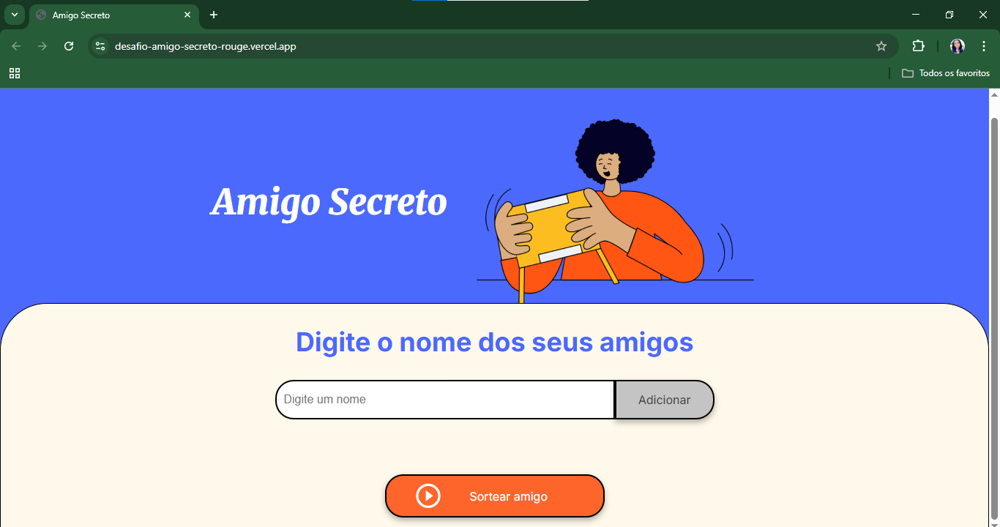
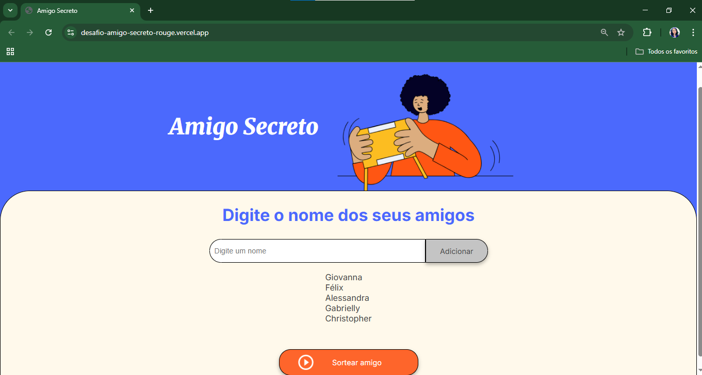
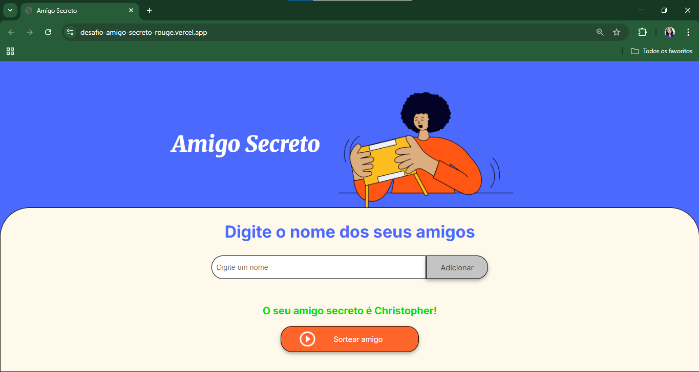

# Desafio - Amigo Secreto

Este projeto foi desenvolvido como parte da **Formação de Novos Programadores** do **Programa ONE (Oracle Next Education)**, uma iniciativa da [Oracle](https://www.oracle.com/br/education/oracle-next-education/) em parceria com a [Alura](https://www.alura.com.br/).  

O objetivo deste desafio é simular um sorteio de **Amigo Secreto**, praticando os fundamentos da programação com **JavaScript**, **HTML** e **CSS**, além de reforçar a lógica de aleatoriedade, manipulação de listas e interação com o usuário.

## ✨ Funcionalidades

- Adicionar nomes à lista de amigos
- Exibir todos os nomes adicionados
- Sortear aleatoriamente um dos amigos
- Exibir o resultado do sorteio de forma destacada
- Interface responsiva e visualmente amigável

## 📸 Capturas de Tela

### Tela Inicial  
Na tela inicial, o usuário pode digitar o nome dos amigos e clicar em "Adicionar" para incluir na lista.



### Lista de Nomes  
Após adicionar, a lista de amigos cadastrados é exibida logo abaixo do campo de entrada.



### Nome Sorteado  
Ao clicar no botão "Sortear amigo", o sistema exibe o nome do amigo secreto sorteado em destaque.




## 💻 Tecnologias Utilizadas

- HTML5
- CSS3
- JavaScript (puro, sem frameworks)


## 🧠 Aprendizados

Durante esse projeto, pratiquei e aprimorei os seguintes conhecimentos:

- Manipulação de arrays e objetos  
- Sorteio de um número (no caso, para o índice de uma array) aleatório  
- Validação de dados  
- Organização de código JavaScript em funções reutilizáveis  
- Interação com o DOM  
- Publicação de projetos com **Vercel**  
- Organização de um projeto web no GitHub  

## 🚀 Como rodar o projeto localmente

Clone este repositório:

```bash
git clone git@github.com:giovannapennisi/desafio-amigo-secreto.git
```
Abra o arquivo `index.html` no seu navegador preferido.  
Divirta-se sorteando seu Amigo Secreto!

## 🌐 Acesse online

O projeto foi publicado utilizando a plataforma Vercel, permitindo que você jogue diretamente no navegador, sem precisar instalar nada:

👉 [Clique aqui para acessar o Desafio - Amigo Secreto](https://desafio-amigo-secreto-rouge.vercel.app/)

---

Feito com 💙 por **Giovanna** durante os estudos no **Programa ONE (Oracle Next Education)**.
